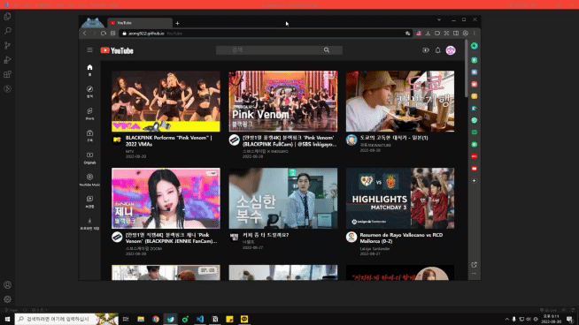
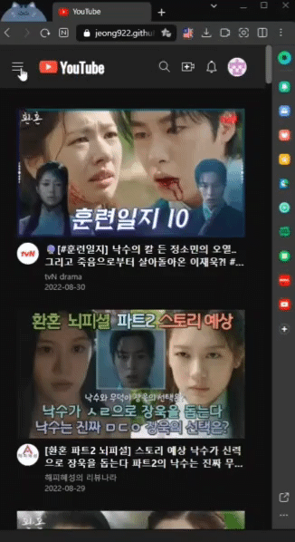
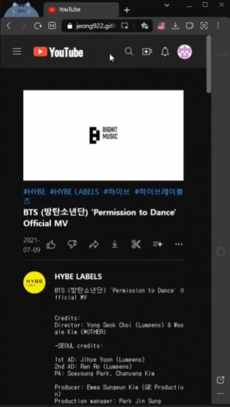
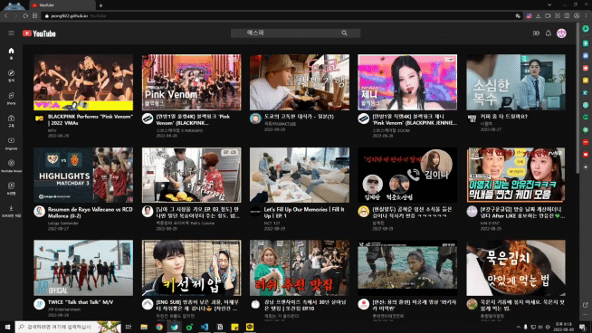
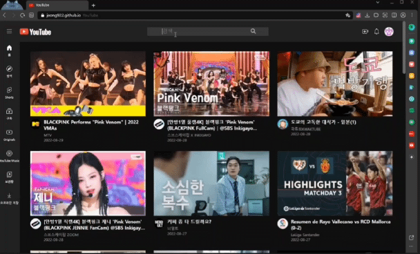

# YouTube clone

## [클릭😊](https://jeong922.github.io/youtube-clone/)

## 목적

- react, PostCSS, youtube api, axios 등을 이용하여 유튜브 클론

## 구성

### 홈

- 인기 동영상 목록이 출력된다.
  

  
  

- 목록에서 원하는 영상을 선택하면 그 영상의 상세정보 페이지로 이동하게 된다.

- 제일 왼쪽 미니 사이드바에 있는 홈 버튼을 누르게 되면 홈으로 이동한다.
- 이 미니 사이드바는 화면이 일정 크기 이하로 줄어들게 되면 출력되지 않는다.
  

  
  
  

- 나머지 버튼들은 아직 기능이 없다...

### 헤더

- 제일 왼쪽 버튼을 누르면 사이드바가 나타나게 된다.
- 유튜브 로고를 클릭하게 되면 홈으로 이동하게 된다.

- 가운데 input에 원하는 검색어를 입력하면 관련된 영상들이 출력된다.

- 제일 오른쪽에 있는 이미지를 누르면 깃허브 저장소로 이동하게 된다.

### 사이드바

- 헤더의 제일 왼쪽 버튼을 누르면 출력된다.
- 홈 버튼을 누르게 되면 홈으로 이동하게 된다.
- 나머지 버튼들은 아직 기능이 없다..

### 검색

- 검색어를 입력하면 검색어와 관련된 영상 목록이 출력된다.
  

  
  

- 목록에서 원하는 영상을 선택하면 그 영상의 상세정보 페이지로 이동하게 된다.

### 비디오 상세 페이지

- 목록에서 선택한 비디오 영상과 영상에 관련된 정보들이 출력된다.
- 오른쪽 관련 콘텐츠는 비디오 id와 관련된 영상 20개가 출력 된다.

- 원하는 비디오를 선택해서 클릭하면 선택한 비디오의 상세페이지로 이동하게 된다.

## 개선할 사항

- [ ] 유튜브 api의 경우 하루 할당량이라는 것이 존재하여 많은 기능을 추가하면 그만큼 할당량 소비가 빨라진다.(지금 있는 기등들만 해도 앱을 사용하다보면 하루 할당량을 금방 사용하게 된다.) 그래서 넣지 못한 기능들이 있는데 계정을 추가하여 api를 사용하거나 할당량을 늘려서 댓글이나 조회수 같은 것들을 추가하고 싶다.
- [x] 다크모드, 라이트 모드 추가(2022.09.13 수정)
- [ ] 지금은 일정 갯수 만큼의 콘텐츠만 보여주고 있지만 무한스크롤 기능을 구현하여 사용자가 스크롤을 내리게 되면 콘텐츠들이 추가로 출력되게 하는 형태로 기능을 추가하고 싶다.
- [x] 로딩 화면을 만든다고 만들었는데 뭔가 적절하게 적용되지 않은 것 같아 수정이 필요하다.(2022.09.01 수정, 차후 더 깔끔하게 수정필요)
